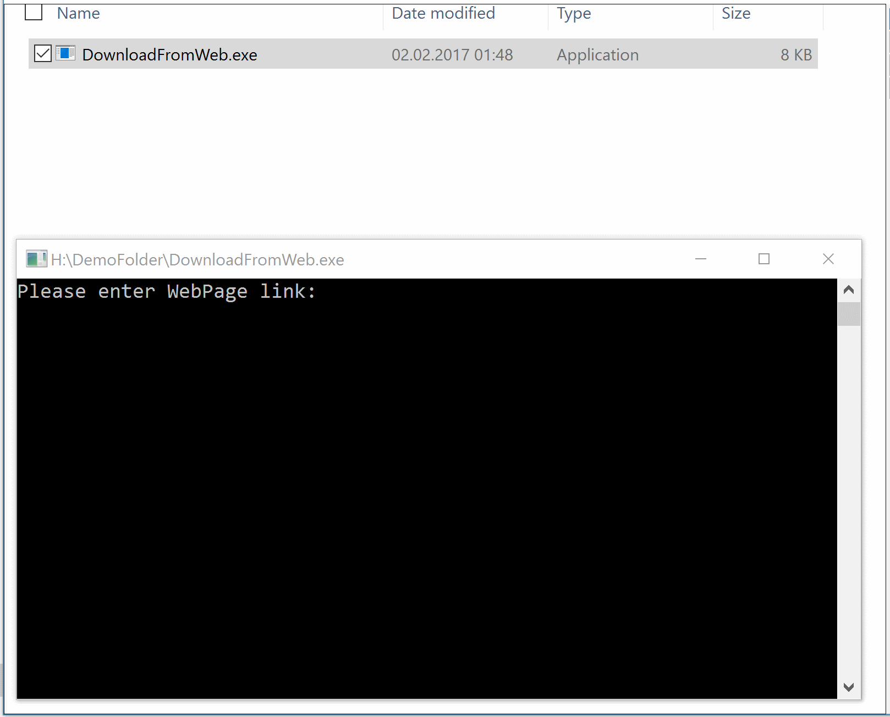

<H1>Short review of Web Content Downloader</H1> 

Using this programm you can download some content from web link: images, mails and links.

```C#
public void SaveInfo(string url)
{
	if (url == null)
	{
		throw new ArgumentNullException(nameof(url));
	}

	//strWrite = new StreamWriter(path);

	Uri uri = new Uri(url);

	try
	{
		htmlContent = webCl.DownloadString(uri);
		GetLinks(htmlContent);
	}
	catch (Exception e)
	{
		Console.WriteLine(e.Message);
		//do something
	}
}
```

##Result
At the end of the runned programm there will be generated following files
* links.txt
* mails.txt
* *Lots of image files*




> This project written for .NET Framework 4.5.2 version, C# 6