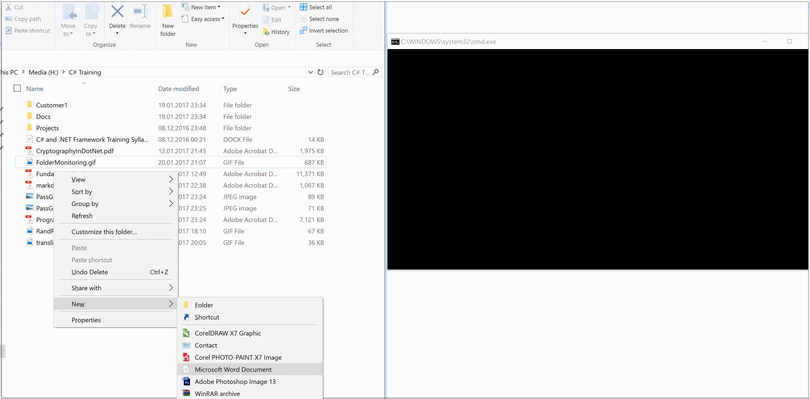

<H1>Short review of Folder Monitoring Program</H1> 

This class library is monitoring given folder by using .Net Framework functionality. <br />
d
Code snipet for WPF project is below: 
```C#

private void Watch_Renamed(object sender, RenamedEventArgs e)
{
    Console.WriteLine($"{e.OldName} was renamed to {e.Name} ");
}

private void Watch_Deleted(object sender, FileSystemEventArgs e)
{
    Console.WriteLine($"{e.Name} was deleted, lets say him GOOD BY.");
}

private void Watch_Created(object sender, FileSystemEventArgs e)
{
    Console.WriteLine($"{e.Name} was created, lets say him WELCOME!!!.");
}

private void Watch_Changed(object sender, FileSystemEventArgs e)
{
    Console.WriteLine($"{e.Name} was changed, lets say him GOOD CHANGES.");
}

```														

You can see below some screeshots of class library usage




> This project written for .NET Framework 4.5.2 version, C# 6