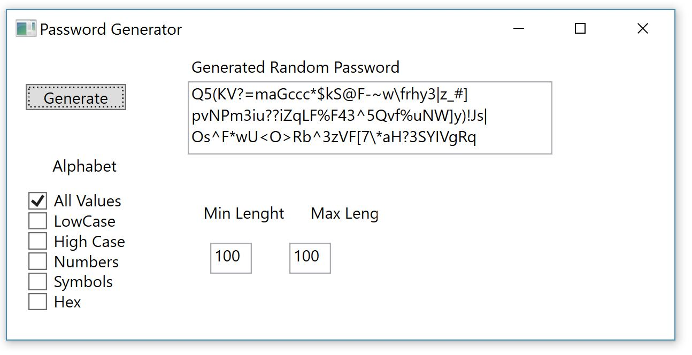
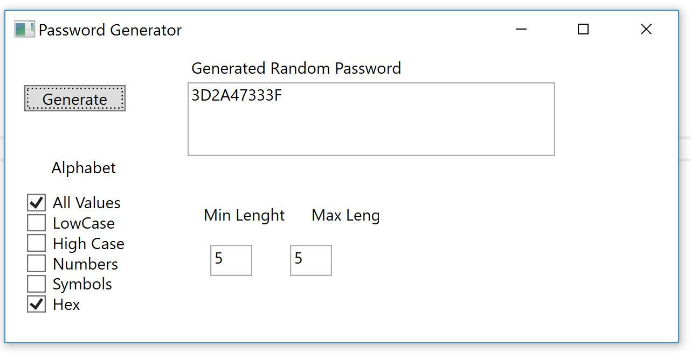

<H1>Short review of Password Generator UI</H1> 

This project demonstrate usage of <b>RandomPassGenerator</b> class Library.

Code snipet for WPF project is below: 
```C#
RandomPasswordGenerator gen = new RandomPasswordGenerator(
                                                        AllCheckBox.IsChecked, LowCheckBox.IsChecked, 
                                                        HighCheckBox.IsChecked, SymbolsCheckBox.IsChecked, 
                                                        NumbersCheckBox.IsChecked, HEXBox.IsChecked
                                                        );

            //Can be passed 0 argument, all except "AllCheckBox" are false by default
            pswdTextBoxHEX.Text = gen.GeneratePasswordRnd();
```														
You can see below some screeshots of WPF application

{:height="200px" width="100px"}
{:height="200px" width="100px"}